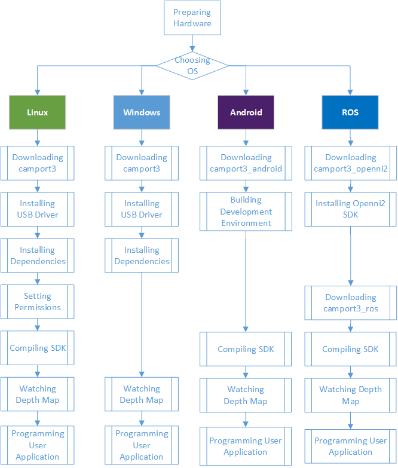
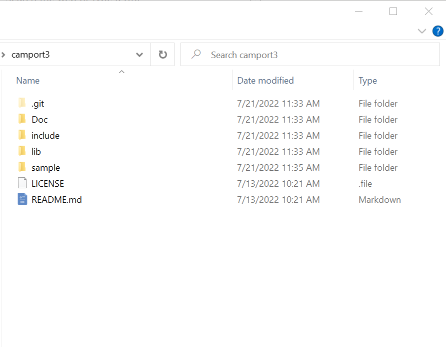

.. _software-preparation-label:

SDK Download and compiling
----------------------------------------

This section aims to guide users in setting up the software environment for developing applications with the Percipio depth camera. This includes downloading and compiling the Percipio software development kit, or Camport SDK for short.

Camport SDK is suitable for Windows, Linux (OpenNI2), Android, and ROS platforms and provides developers with a range of user-friendly APIs and simple sample programs. Users can use Camport SDK to obtain :ref:`Depth Image <depth-image-label>`、:ref:`Infrared Image <ir-image-label>`、:ref:`Color Image <color-image-label>` and :ref:`Point Cloud <point3D-image-label>` for applications such as navigation, obstacle detection, 3D modeling, gesture recognition, etc.

.. _build-pc-environment-label:

Host Computer Development Environment 
~~~~~~~~~~~~~~~~~~~~~~~~~~~~~~~~~~~~~~~~~~~~~~~~~~~

If you need to run or develop host computer image application software, please configure the host computer development environment first, including downloading Camport SDK, configuring, compiling and running.

The configuration of Camport SDK application development environment is shown in the following figure:

    Configuration of Camport SDK Application Development Environment

Windows Platform (C++)
+++++++++++++++++++++++

The Windows SDK supports X86 (32-bit) and X64 (64-bit) hardware platforms and provides driver files that support Windows 7 and higher versions operating systems. The Windows SDK includes some directly executable applications (such as viewing depth images) and some sample code for applications.

Below is an example of building a development environment for the Percipio depth camera on the Windows platform using a Windows 10 X64 system.

1. :ref:`Downloading Camport3 SDK <download-sdk-windows-label>`

2. :ref:`Installing Dependencies <install-dependence-windows-label>`

3. :ref:`compiling <code-windows-label>`

.. _download-sdk-windows-label:

Downloading Camport3 SDK
*************************

Choose one of the following methods to download Camport3 SDK:

Use your web browser to visit https://github.com/percipioxyz/ and download Camport3 SDK.

Use git command to obtain a local copy: open the terminal, navigate to the working directory where you want to store the SDK, and type the 'git clone' command to clone the remote repository.
   
  ::
      
     git clone https://github.com/percipioxyz/camport3.git

The directory structure of Camport3 SDK is shown in the following figure:

    Camport3 SDK Directory Structure

**Doc** Directory

This directory contains the SDK API reference documentation. The PDF file is generated using Doxygen and includes descriptions of classes, structures, and interfaces.

**include** Directory
This directory contains header files for calling dynamic libraries:

* ``TYImageProc.h``: Header file for image post-processing function interfaces.

* ``TYCoordinateMapper.h``: Mapping for image space conversion

* ``TY_API.h``: Provides all APIs for configuring the depth camera and getting image data. Users can develop their own applications based on these APIs.

**lib/linux** Directory

This directory contains library files that support the Linux operating system, compatible with AArch64, ARMv7hf, RaspberryPi, i686, and x86-64 hardware platforms.

**lib/win** Directory

This directory contains library files that support the Windows operating system, compatible with x64 and x86 hardware platforms.

**sample** Directory

This directory contains sample programs that users can refer to for programming. For more details, see :ref:`Sample Program Instructions <sample-exe-label>`.

.. _install-dependence-windows-label:

Installing Dependencies
*************************

**CMake**
CMake is a cross-platform installation (compiling) tool that can describe the installation (compiling) process for all platforms using simple statements. It can output various types of makefiles or project files and can test the C++ features supported by the compiler, similar to automake under UNIX. The configuration file for CMake is named CMakeLists.txt. CMake does not directly build the final software, but generates standard build files (such as UNIX's Makefile or Windows Visual C++'s projects / workspaces), which can then be used in a general building process.

Camport SDK uses CMake to build standard projects and utilizes the capabilities of each platform's native build system, making it adaptable to different platform environments.

.. note::
   
   Camport SDK requires users to install CMake version 2.8.0 or higher versions.

**OpenCV**

Camport SDK can receive depth data output from the Percipio depth camera through the Ethernet interface. After obtaining the depth data, the sample programs provided in Camport SDK use the OpenCV image processing software library to do rendering. Before compiling the sample programs, make sure that the OpenCV image processing software library is installed.

.. note::

   1. Camport SDK requires users to install OpenCV version 2.4.8 or higher versions.
   
   2. If the target application program does not use OpenCV for image display or other image processing functions, there is no need to install OpenCV.

.. _code-windows-label:

compiling
*******************

Before compiling, do the following:

1. Install Visual Studio.

2. Install :ref:`dependencies <install-dependence-windows-label>`。

.. note:: 

   1. When installing Visual Studio, make sure to select the Visual C++ library module. Othewise the compiling will fail.
   2. If you are unsure how to install the Visual C++ library, please contact Percipio customer support for assistance.

The compiling steps are as follows:

1. Create a ``build`` directory in the SDK sample directory.

2. Launch **cmake-gui**.

3. Specify the source code directory as sample and the compiling output directory as sample/build.

   .. figure:: ../image/wincompilestep1.png
       :width: 480px
       :align: center
       :alt: wincompilestep2
       :figclass: align-center

4. Click on :guilabel:`Configure`, select the corresponding Visual Studio version, and click on :guilabel:`Finish`.

   .. figure:: ../image/wincompilestep2.png
       :width: 480px
       :align: center
       :alt: wincompilestep2
       :figclass: align-center

5. Specify the OpenCV_DIR as the file path of ``opencv/build``.
   
   .. figure:: ../image/wincompilestep3.png
       :width: 480px
       :align: center
       :alt: wincompilestep3
       :figclass: align-center

6. Configure the file path for OpenCV library in the system environment variables.
   
   Specific steps: Enter **Environment Variables** dialog box, select the "Path" column and click on :guilabel:`Edit`. In **Edit Environment Variables**  dialog box, configure the path of the OpenCV library.
   
   .. figure:: ../image/wincompilestep5-en.png
      :width: 480px
      :align: center
      :alt: wincompilestep5
      :figclass: align-center

7. Click on :guilabel:`Generate`.

    .. figure:: ../image/wincompilestep4.png
       :width: 480px
       :align: center
       :alt: wincompilestep4
       :figclass: align-center

8. Click on :guilabel:`Open Project` to open the project.
   
   .. figure:: ../image/wincompilestep6.png
       :width: 480px
       :align: center
       :alt: wincompilestep6
       :figclass: align-center
  
  .. note::
     
     Afterwards, you can open the project by using ``Project.sln`` file or ``ALL_BUILD.vcxproj`` file located in the ``camport3/sample/build`` file path.

9.  Compile the project: click on  :guilabel:`Build` in the Visual Studio menu bar, and then click on :guilabel:`Build Solution`.

   .. figure:: ../image/wincompilestep7.png
       :width: 480px
       :align: center
       :alt: wincompilestep7
       :figclass: align-center

.. _run-windows-label:

Running
*********************

After connecting to the PC, the depth camera starts system initialization process until the Power light on the back of the camera blinks at a frequency of 1Hz. In Windows 10 x64 system，run the executable file ``lib/win/hostapp/x64/SimpleView_FetchFrame.exe`` to capture depth images. Or alternatively,  copy the ``lib/win/hostapp/x64/tycam.dll`` file to folder ``sample/build/bin/Release`` generated by the compiling, and run the ``SimpleView_FetchFrame.exe`` file in this folder to capture depth images.

