Percipio Viewer User Guide
============================    

Percipio Viewer is an image viewing software developed by Percipio.XYZ based on the Percipio Camport SDK. It can provide real-time preview of the camera's output, including depth images, color images, infrared images, and point clouds.

Percipio Viewer is available in both Windows and Linux versions, and it is recommended to use the Windows version. The following sections will use the Percipio Viewer (Windows version) as an example to introduce its interface and functions.

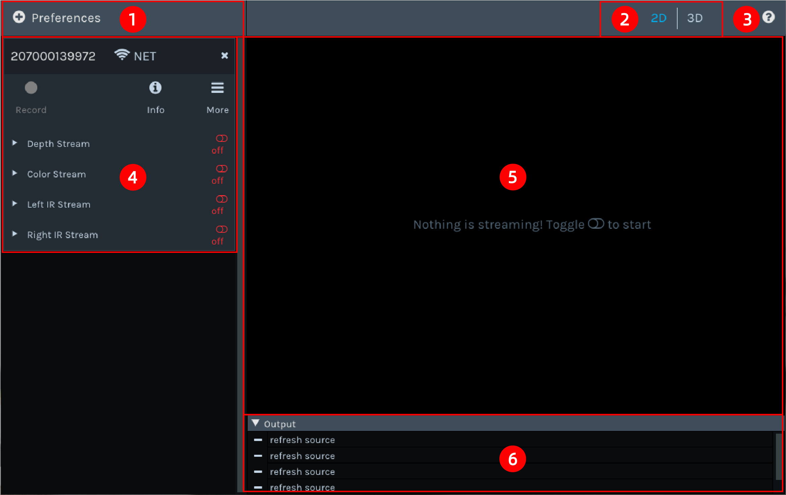

   The Interface of Percipio Viewer Software

1. Preferences Button: Clicking on the Preferences button will bring up a drop-down menu.
   
   .. figure:: image/preferences_menu.png
      :width: 480px
      :align: center
      :alt: The Drop-Down Menu
      :figclass: align-center

      The Drop-Down Menu

   a. Device list: You can select and open the camera from the list. See :ref:`Selecting the Camera <viewer_en:Selecting the Camera>` for details.
   b. Load local recording.
   c. Set the IP of the camera. See :ref:`Setting the Camera IP <viewer_en:Setting the Camera IP Address>` for details.
   d. Refresh the device list.

2. View Switching Area: Used to switch among 2D, 3D, Registration, and Color 3D views.
3. |?| Button: Go to the Percipio Viewer User Guide page.
4. Control Panel Area: Used to view information, set work mode, toggle on/off data streams, set component parameters, and record videos.   
   
   * |on| indicates that the data stream is toggled on.
   * |off| indicates that the data stream is toggled off.

5. Image Display Area: Used to display the depth image, color image, infrared image, and point cloud.
6. Log Display Area: Used to display log information.

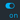
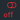

Quick Start
---------------

This section mainly introduces the usage process of Percipio Viewer:

1. :ref:`Setting the Camera IP Address <viewer_en:Setting the Camera IP Address>`
2. :ref:`Selecting the Camera <viewer_en:Selecting the Camera>`
3. :ref:`Viewing Information <viewer_en:Viewing Information>`
4. :ref:`Setting Work Mode <viewer_en:Setting work mode>`
5. :ref:`Previewing Images <viewer_en:Previewing Images>`
6. :ref:`Saving Images <viewer_en:Saving Images>`
7. :ref:`Recording Videos <viewer_en:Recording Videos>`

Complete the following steps before using Percipio Viewer:

1. Download the .zip file from `Download Section on Percipio official website <https://www.percipio.xyz/downloadcenter/>`_  and unzip it to obtain the ``percipio-viewer-X.X.X.exe`` file.

2. Connect the Percipio camera to the host computer. For connection instructions, see :ref:`Hardware Connection <hardware-connection-label>` .

Setting the Camera IP Address
~~~~~~~~~~~~~~~~~~~~~~~~~~~~~~~~~~~~

Percipio Viewer supports modifying the IP address of the camera to be either static or dynamic. Before setting the camera IP, make sure the host computer's IP address is on the target network segment.   

To set the camera's IP address, do the following:

1. Click on :guilabel:`Preferences` and select :guilabel:`Device IP Settings` from the drop-down menu to access **Device IP Settings** page.

   .. figure:: image/device_ip_settings_interface.png
      :width: 320px
      :align: center
      :alt: device IP settings
      :figclass: align-center   

      Device IP Settings     

2. In **Net interface list** column, select the network interface of the target network segment or choose **All network interfaces**.
3. In **Found device** column, select the target camera's serial number (SN).
4. Fill in **Device mac address**, **Device target IP**, **Device target gate**, and **Device target mask**.
   
   .. note::
       
       If the Device target IP field is left blank, the camera's IP address will be set to a dynamic one. If filled in, it will be set to a static IP address.

5. Click on :guilabel:`Accept`.

The message "Device IP setting is successful" in the log display area indicates that the IP has been successfully set.

The message "Device IP setting failed" in the log display area indicates that the IP setting has failed. Check your computer's network configuration and hardware connections, and ensure that the parameters on the Device IP Settings page are filled in correctly.

Selecting the Camera
~~~~~~~~~~~~~~~~~~~~~~~~~~~~~~~~

Starting from version 1.2.3 of Percipio Viewer, you need to manually select and open the camera after opening the software.

To select the camera, do the following (taking the camera with SN 207000106916 as an example):

1. Dubble click the executable file ``percipio-viewer-X.X.X.exe`` to open Percipio Viewer software.
   
2. After the camera initialization is complete, click on :guilabel:`Preferences`, and then select :guilabel:`Refresh Source` in the drop-down menu to refresh the device list.

3. Choose the SN of the target camera **207000106916** from the device list.

   .. figure:: image/select_camera.png
      :width: 700px
      :align: center
      :alt: Selecting the Camera
      :figclass: align-center
   
      Selecting the Camera
      
.. note:: 

   If an error code is displayed after the SN in the device list (such as "-1014" in the above image), it indicates that the camera cannot be opened.

Viewing Information
~~~~~~~~~~~~~~~~~~~~~~~

Click on |info| allows you to view camera information, including interface name, SN, model, MAC/IP address, firmware version, and configuration version.

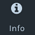

The firmware version information is quite lengthy, so you will need to hover your mouse over **Firmware Version** to view the complete content.

Setting Work Mode
~~~~~~~~~~~~~~~~~~~~~~~~~~

Percipio Viewer supports setting the work mode of the camera, and the camera captures images according to the settings.

Click on |more| when all data streams are in status |off|, and select the work mode according to the table below.

.. list-table::
   :header-rows: 1

   * - Work Mode
     - Camera Operating Status
   * - Trigger Mode Off 
     - After the data stream is toggled on, the camera captures images continuously at the highest frame rate.
   * - Hardware Trigger Mode
     - An external hardware trigger signal source need to be connected to the camera. Then after toggling on the data stream, the camera captures images according to the frequency of the trigger signal .
   * - Software Trigger Mode (continue)
     - After the data stream is toggled on, the camera captures images upon receiving a software trigger signal.
   * - Software Trigger Mode (single)
     - With data streams toggled on, the camera captures one frame of image upon clicking on the |trigger| button.

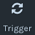

The selected work mode will have an icon  **√**  displayed on its right side.

.. figure:: image/selected_mode.png
   :width: 480px
   :align: center
   :alt: The Selected work mode
   :figclass: align-center

   The Selected Work Mode

Previewing Images
~~~~~~~~~~~~~~~~~~~~~~~

Percipio Viewer supports previewing depth images, color images, left/right infrared images, point clouds, and adjusting component parameters.

Follow these steps to preview images:

1. Toggle on the data stream to preview the corresponding image in real-time in the image display area.

   The title bar above the image displays the current data stream name, image resolution, and frame rate.

   .. figure:: image/show_stream_info.png
      :width: 700px
      :align: center
      :alt: Depth Image, Color Image, and Left/Right Infrared Image
      :figclass: align-center
      
      Depth Image, Color Image, and Left/Right Infrared Image
     
   .. |right| image:: image/icon_right.png  

2. Expand the page by clicking on |right| on the left side of the data stream, and adjust parameters according to actual needs.

  .. note::

 	  1. Some parameters can only be modified when the data stream is in status |off|. It is recommended to refer to the logs in the log display area for instructions.
 	  2. Different camera models support different parameters, and the display on the Percipio Viewer interface changes accordingly. The following table describes the parameters, taking the camera with SN  **207000106916** as an example.
    
  .. figure:: image/para_207000106916.png
     :width: 700px
     :align: center
     :alt: Parameter Interface for Camera 207000106916
     :figclass: align-center
     
     Parameter Interface for Camera 207000106916

  .. dropdown:: Parameter Description
      :open:
      :animate: fade-in-slide-down
          
      **Depth Stream** 

      +----------------------+-----------------+---------------------------------------------------------------------------------------------------------+
      | Category             |    Parameter    |    Description                                                                                          |
      +======================+=================+=========================================================================================================+
      | —                    |  Resolution     |  Resolution of the Depth Image                                                                          |        
      +----------------------+-----------------+---------------------------------------------------------------------------------------------------------+
      | Control              | Power           | Laser Intensity                                                                                         |
      +----------------------+-----------------+---------------------------------------------------------------------------------------------------------+
      | Depth Visualization  | Color Scheme    | Rendering method of the Depth Image                                                                     |
      +----------------------+-----------------+---------------------------------------------------------------------------------------------------------+
      | Post-Processing      | Fill Hole       | Rendering method of the Depth Image. For more details, see :ref:`Fill Hole <viewer_en:Fill Hole>`.      |
      +                      +-----------------+---------------------------------------------------------------------------------------------------------+
      |                      | Remove Outlier  | Noise reduction. For more details, see :ref:`Remove Outlier <viewer_en:Remove Outlier>`.                |
      +----------------------+-----------------+---------------------------------------------------------------------------------------------------------+

          
      **Color Stream** 

      +----------------------+--------------------+-------------------------------------------------------------------------------------------------------------------+
      | Category             |    Parameter       |    Description                                                                                                    |
      +======================+====================+===================================================================================================================+
      | —                    |  Resolution        |  Resolution of color image                                                                                        |        
      +----------------------+--------------------+-------------------------------------------------------------------------------------------------------------------+
      |                      | analog gain        | Analog gain                                                                                                       |
      +                      +--------------------+-------------------------------------------------------------------------------------------------------------------+
      |                      | r/g/b gain         | R/G/B gain                                                                                                        |
      +                      +--------------------+-------------------------------------------------------------------------------------------------------------------+
      | Control              | exposure time      | Exposure time                                                                                                     |
      +                      +--------------------+-------------------------------------------------------------------------------------------------------------------+
      |                      | auto exposure      | Auto exposure, supported by some camera models only.                                                              |
      +                      +--------------------+-------------------------------------------------------------------------------------------------------------------+
      |                      | struct aec roi     | Auto expose based on ROI, supported by some camera models only. Left-click the color image and drag the           |
      |                      |                    | mouse to frame the target area as Region of Interest (ROI). The exposure time and the gain for the entire color   |
      |                      |                    | image will be automatically adjusted so that the RGB image quality in the ROI is optimized.                       |     
      +                      +--------------------+-------------------------------------------------------------------------------------------------------------------+
      |                      | auto gain ctrl     | Auto gain control, supported by some camera models only.                                                          |
      +                      +--------------------+-------------------------------------------------------------------------------------------------------------------+
      |                      | auto white balance | Auto white balance, supported by some camera models only.                                                         |
      +----------------------+--------------------+-------------------------------------------------------------------------------------------------------------------+
      | Post-Processing      | Auto ISP           | Software ISP, supported by some camera models only. For details, see :ref:`Auto ISP<viewer_en:Auto ISP>`.         |
      +                      +--------------------+-------------------------------------------------------------------------------------------------------------------+
      |                      | Undistort EN       | Undistorting function. For details, see :ref:`Undistort<viewer_en:Undistort>`.                                    |
      +----------------------+--------------------+-------------------------------------------------------------------------------------------------------------------+

      **Left IR / Right IR Stream** 

      +----------------------+-----------------+---------------------------------------+
      | Category             |    Parameter    |    Description                        |
      +======================+=================+=======================================+
      |  Control             | Gain            | Gain.                                 |
      +                      +-----------------+---------------------------------------+
      |                      | Power           | Laser intensity.                      |
      +----------------------+-----------------+---------------------------------------+
 
  
3. Click the  :guilabel:`2D`, :guilabel:`3D`, :guilabel:`Registration`, and  :guilabel:`Color 3D` buttons in the View Switching Area to switch views.
   
   .. note::
    
      Registration or Color 3D views can only be switched to when both the depth stream and color stream are toggled on.

4. Place your mouse on the 2D/3D image and adjust the view using the following methods:
   
   * Zoom in/out: Scroll the mouse wheel.
   * Pan (only supported in 3D/Color 3D views): Press and drag the mouse wheel.
   * Rotate (only supported in 3D/Color 3D views): Press and drag the left mouse button.
   * Reset the view (only supported in 3D/Color 3D views): Click on |reset|

    .. |reset| image:: image/reset.png

Recording Videos
~~~~~~~~~~~~~~~~~

Percipio Viewer supports recording videos while capturing images with a camera. Some parameters can be adjusted during recording, but toggling on/off the data stream is not supported.

Follow these steps to record a video:

1. Click on |record|, set the save path for the ``.bag`` file and the video recording will start.

   .. |record| image:: image/icon_record.png

   .. note:: 

     The ``.bag`` file is saved in the C drive by default. 

   .. figure:: image/record_interface-en.png
      :width: 400px
      :align: center
      :alt: Video Recording
      :figclass: align-center

      Video Recording

2. Click on |stop| to end the video recording.               

   .. |stop| image:: image/icon_stop.png

   The save path for the ``.bag`` file will be displayed in the image display area's upper right corner and the log display area.

To play back the recorded video, click on :guilabel:`Preferences`, then click on :guilabel:`Load Recorded Sequence` in the drop-down menu and select the target ``.bag`` file.

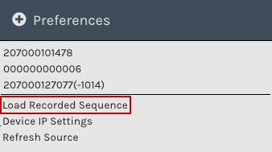
   
   Video Playback

Saving Images
~~~~~~~~~~~~~~~~~~~~~~~

Follow the steps below to save 2D/3D images:

.. note:: 
    
   By default, the image files are saved in the C drive, but you can also change the storage path according to your preferences. 

* Switch to the 2D view, click on |2D|, select the save path, and click Save.

   .. |2D| image:: image/icon_save_2D.png
   .. |3D| image:: image/icon_save_3D.png

* Switch to the 3D/Color 3D view, click on |3D|, select the file format for the 3D point clouds (supports ``.xyz`` and ``.ply`` formats), select the save path, and click Save.

Image Processing (Software)
------------------------------

This section mainly introduces the image processing functions supported by Percipio Viewer software:

* :ref:`Image Alignment <viewer_en:Image Alignment>`
* :ref:`Fill Hole <viewer_en:Fill Hole>`
* :ref:`Remove Outlier <viewer_en:Remove Outlier>`
* :ref:`Auto ISP  <viewer_en:Auto ISP>`
* :ref:`Undistort  <viewer_en:Undistort>`

Image Alignment
~~~~~~~~~~~~~~~~~~~~~~~~~

Percipio Viewer supports RGB-Depth alignment and RGB-3D alignment.

When the Depth Stream and Color Stream are in status |on|, click the following buttons to switch to the corresponding alignment view.

- Click on :guilabel:`Registration` to switch to the color-depth alignment view.
- Click on :guilabel:`Color 3D` to switch to the color-point cloud alignment view.

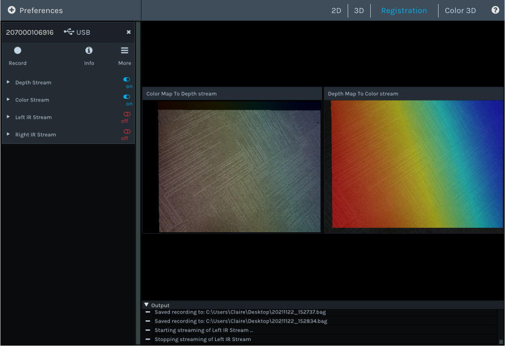
   
   Color-Depth Alignment

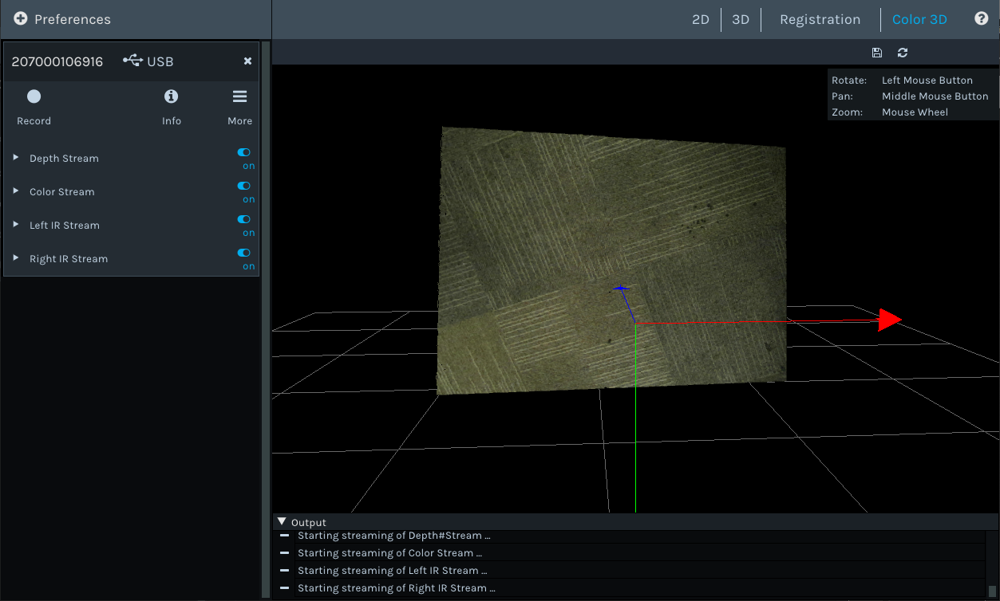
   
   Color-Point Cloud Alignment

Auto ISP
~~~~~~~~~~~~~~

This function is used for post-processing of color images. After the software-level ISP processing, the RAW BAYER image with color deviation can be processed into a color image in a normal color space.

.. note:: 

   Cameras with hardware ISP modules can output color images in a normal color space, and therefore does not need to be post-processed by the Auto ISP function.

When Color Stream is in status |off|, select :guilabel:`Auto ISP`, and then toggle on the data stream.

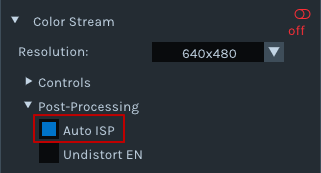

Undistort
~~~~~~~~~~~~~~~~~~~~

This function is used for post-processing of color images and can undistort the output color image.

when Depth Stream is in status |on|, select :guilabel:`Undistort EN` to  obtain the undistorted color image.

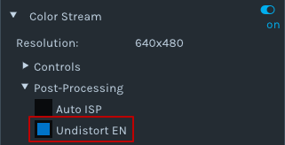

Remove Outlier
~~~~~~~~~~~~~~~~~~~~~~~~~

This function can reduce outliers on the depth image and optimize the imaging effect of the depth image.

When Depth Stream is in status |on|, select :guilabel:`Remove Outlier`, and adjust the **spk size** parameter.

.. figure:: image/remove_outlier_settings.png 
   :width: 320px
   :align: center
   :alt: Remove Outlier  
   :figclass: align-center

Fill Hole 
~~~~~~~~~~~~~~~~~~~~~~

The function can fill in missing data on a depth image. When used in combination with the "Remove Outlier" function, it can achieve the best results for the depth image.

When the Depth Stream is in status |on|, select :guilabel:`Fill Hole`, and adjust the parameters **k Size** and **h Size**.

.. note:: 

    If the parameter values of k Size and h Size are set too large, there may be distortion on the depth image.

Comparison before and after using the Fill Hole function:

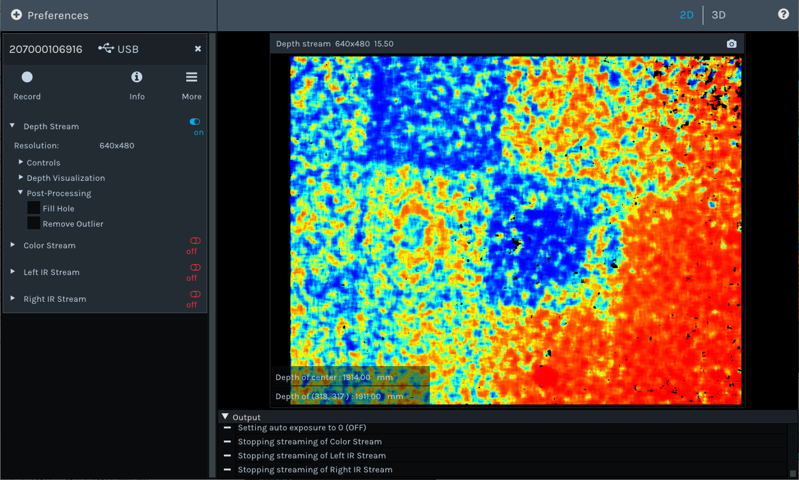
   
   Before Using the Fill Hole Function
       
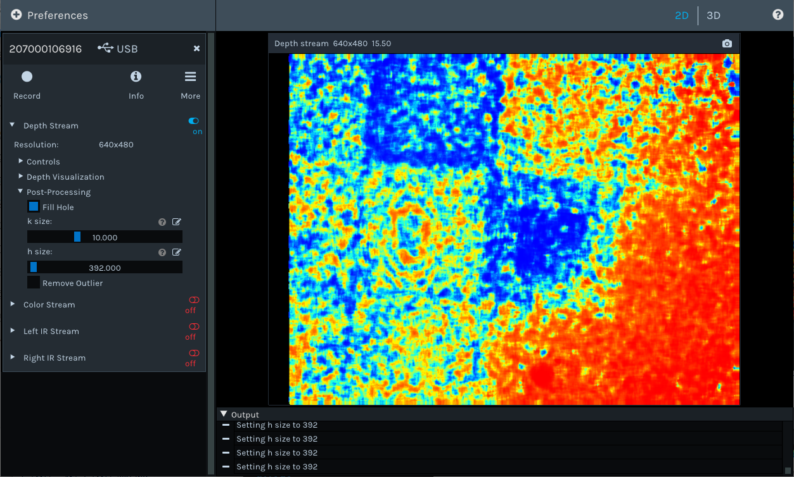
   
   After Using the Fill Hole Function

Image Processing (Camera)
---------------------------------

This section mainly introduces how to set camera-specific image processinging functions through Percipio Viewer.

The ToF Series
~~~~~~~~~~~~~~~~~~~~~~~~

The following are the image processing functions unique to the ToF series. They can only be set in the interface if the camera is opened with Percipio Viewer.

* :ref:`Depth Quality <viewer_en:Depth Quality>`
* :ref:`ToF Channel <viewer_en:ToF Channel>`
* :ref:`ToF Modulation Threshold <viewer_en:ToF Modulation Threshold>`
* :ref:`ToF Jitter Threshold <viewer_en:ToF Jitter Threshold>`
* :ref:`Filter Threshold <viewer_en:Filter Threshold>`
* :ref:`HDR Ratio <viewer_en:HDR Ratio>`

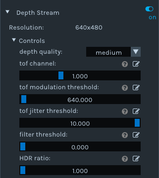

Depth Quality 
+++++++++++++++++++++++

This function is used to set the quality of the depth image output by the camera to adapt to the needs of different applications.

When Depth Stream is in status |off|, set **depth quality** according to actual needs, and then toggle on the data stream.

* basic: large depth value jitter, high output frame rate.
* medium: medium depth value jitter, medium output frame rate. 
* high: small depth value jitter, low output frame rate.

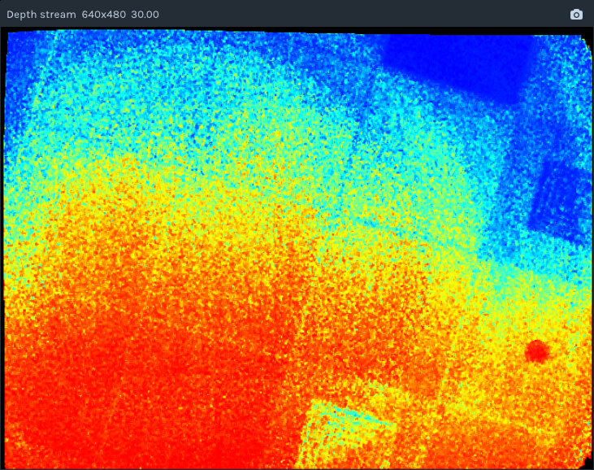
   
   depth quality basic 

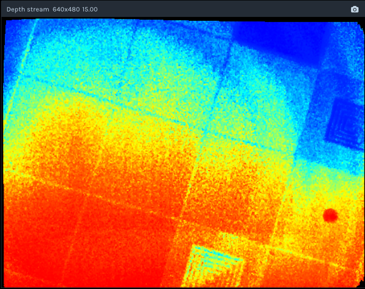
   
   depth quality medium 

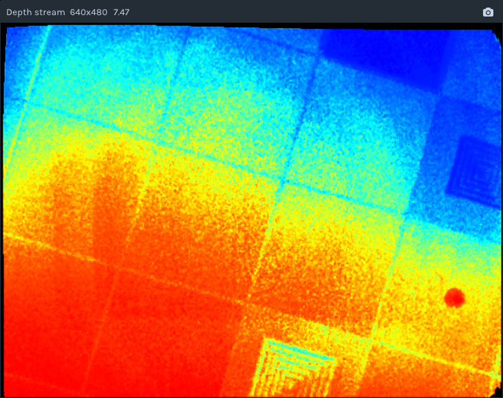
   
   depth quality high

ToF Channel
+++++++++++++++++++++++

This function is used to set the modulation channel of the ToF depth camera. Different modulation channels have different modulation frequencies and do not interfere with each other.

When Depth Stream is in status |off|, set **tof channel** to make sure that the modulation channels of the same series of ToF cameras in the same scene are different.

ToF Modulation Threshold 
++++++++++++++++++++++++++++++++++++++++

This function is used to set the threshold for the ToF depth camera to receive the laser modulation intensity. Pixels with modulation intensity below this threshold will not be used to calculate depth, and their depth value will be set to 0.

When Depth Stream is in status |on|, modify **tof modulation threshold** based on the real-time depth image.

ToF Jitter Threshold
+++++++++++++++++++++++++++++++

This function is used to set the jitter filtering threshold for the ToF depth camera. The larger the threshold value, the less depth data jitter on the depth image's edge is filtered.

When Depth Stream is in status |on|, modify **tof jitter threshold** based on the real-time depth image to filter out jittered pixels on the edge.

Filter Threshold
++++++++++++++++++++++++++++

This function is used to set the outlier filtering threshold for ToF depth camera. The smaller the threshold value, the more outliers are filtered.

When Depth Stream is in status |on|, adjust **filter threshold** in real time based on the depth image to filter outliers out.

HDR Ratio
+++++++++++++++++++++++

This function is used to optimize the quality of the depth image in high-contrast scenes. Currently, only TL460-S1-E1 in the ToF series support this function.

To set up the HDR Ratio, do the following: 

1. When all data streams are in status |off|, click on |more| and select a trigger mode according to your needs.
   
    - Hardware Trigger Mode 
    - Software Trigger Mode (continue) 
    - Software Trigger Mode (single) 

2. When Depth Stream is in status |off|, set **depth quality** to **high**.
3. When Depth Stream is in status |on|, adjust **HDR ratio** in real time based on the depth image.

The PS Series
~~~~~~~~~~~~~~~~~

The following are the image processing functions unique to the PS series. They can only be set in the interface if the camera is opened with Percipio Viewer.

* :ref:`Flash Light <viewer_en:Flash Light>`
* :ref:`HDR <viewer_en:HDR>`

Flash Light
+++++++++++++++++

This function is used to assist the online dynamic calibration for the camera.

When both Left IR Stream and Right IR Stream are in status |on|, select :guilabel:`flash light enable` and adjust the **flash light intensity** according to actual needs.

   
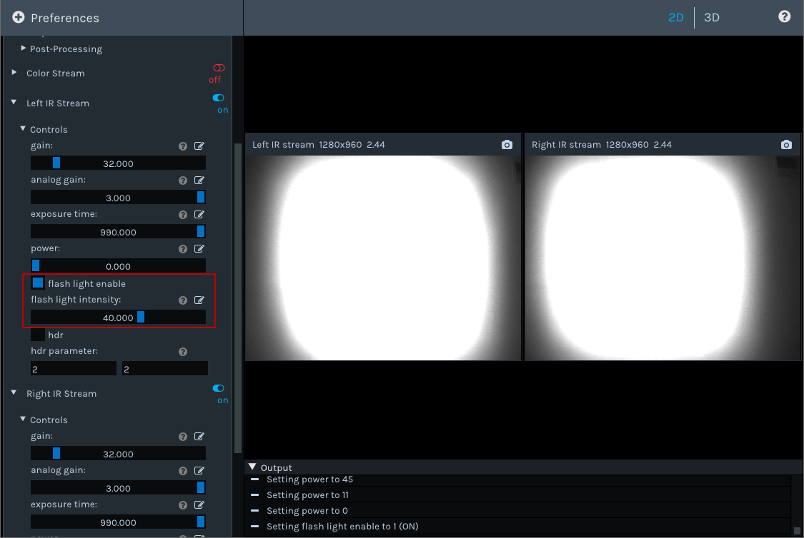
   
   Set Flash Light Function

HDR
+++++++++++++++

This function is used to optimize the quality of the depth image in high-contrast scenes. After setting the HDR parameters, it is necessary to adjust the exposure time of the Left/Right IR to obtain the best quality of the depth image.

To set up the HDR function, do the following:

1. When both Left IR Stream and Right IR Stream are in status |on|, select :guilabel:`HDR` to set **Parameter 1** and **Parameter 2**, and then press :guilabel:`Enter` to confirm the settings.
   
   .. tip:: 

      The setting range for parameter 1 and parameter 2 is 0, 1, 2.

   .. figure:: image/parameter_1_2-en.png
      :width: 320px
      :align: center
      :alt: Set Parameter 1 and Parameter 2
      :figclass: align-center
   
      Set Parameter 1 and Parameter 2

2. Adjust the **exposure time** of Left IR and Right IR to obtain the best depth image.

Comparisons before and after Implementing the HDR function:

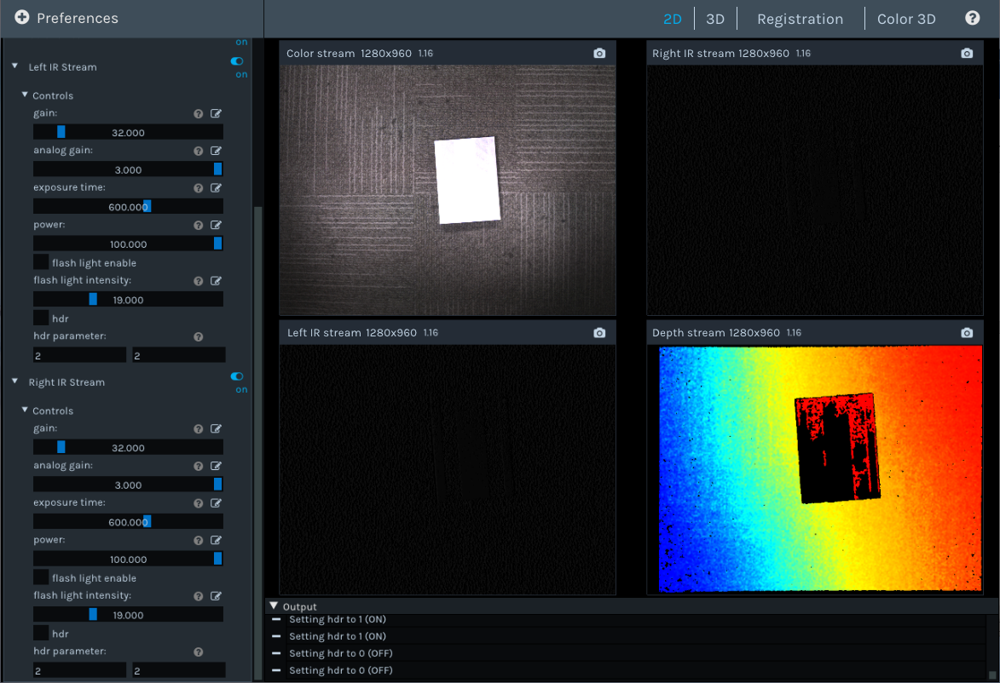
   
   Before Implementing the HDR Function

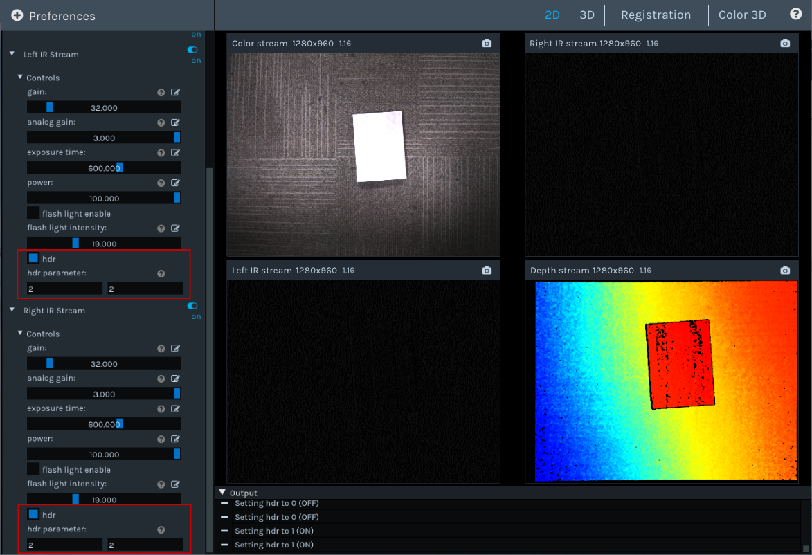
   
   After Implementing the HDR Function

.. _viewer-faq-label:

FAQs
---------------

What operating systems are supported by Percipio Viewer?
~~~~~~~~~~~~~~~~~~~~~~~~~~~~~~~~~~~~~~~~~~~~~~~~~~~~~~~~~~~~

*  Windows: 10/11
*  Linux: Ubuntu 16.04/18.04/20.04

