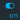
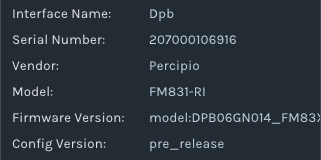
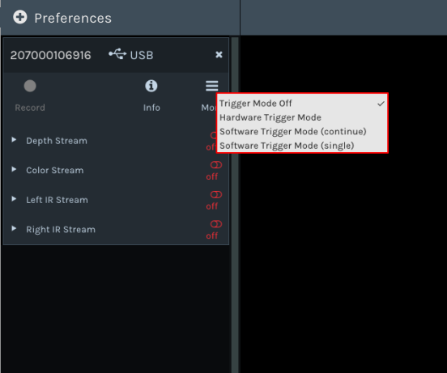
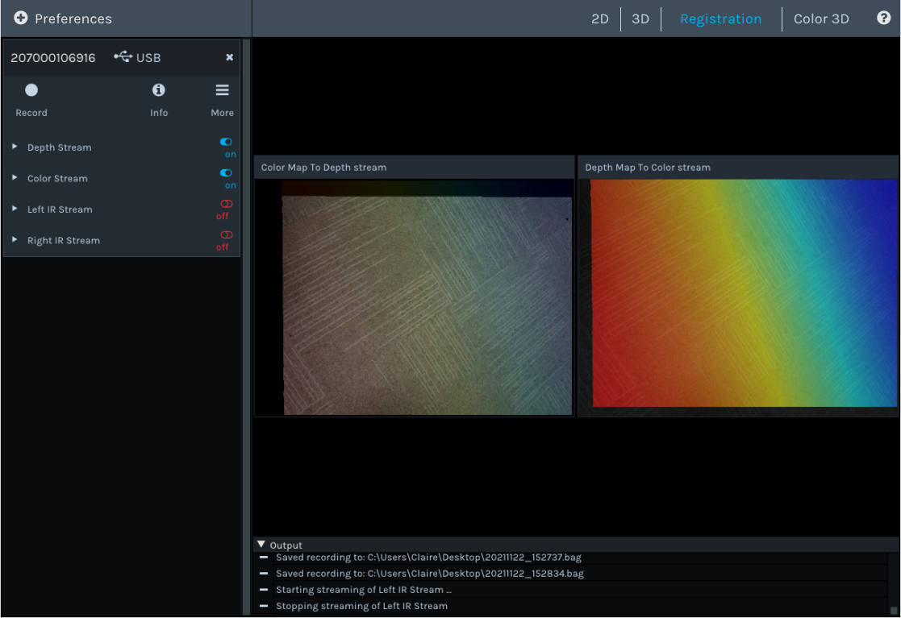
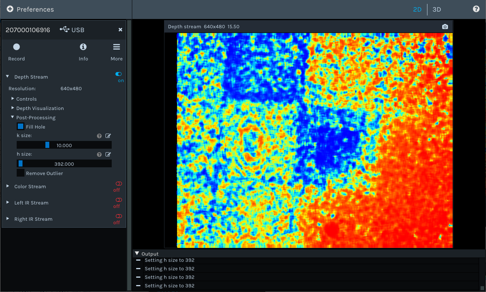
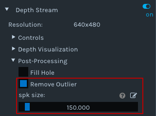
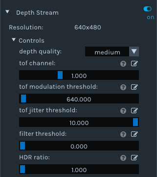
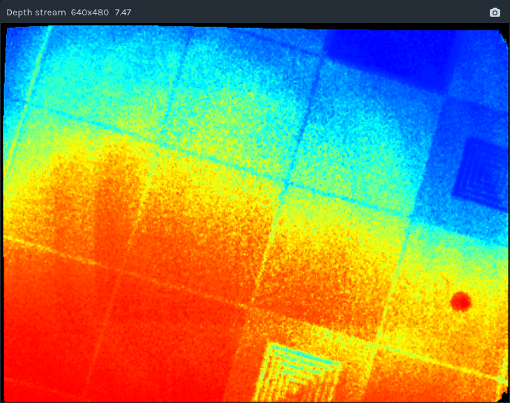
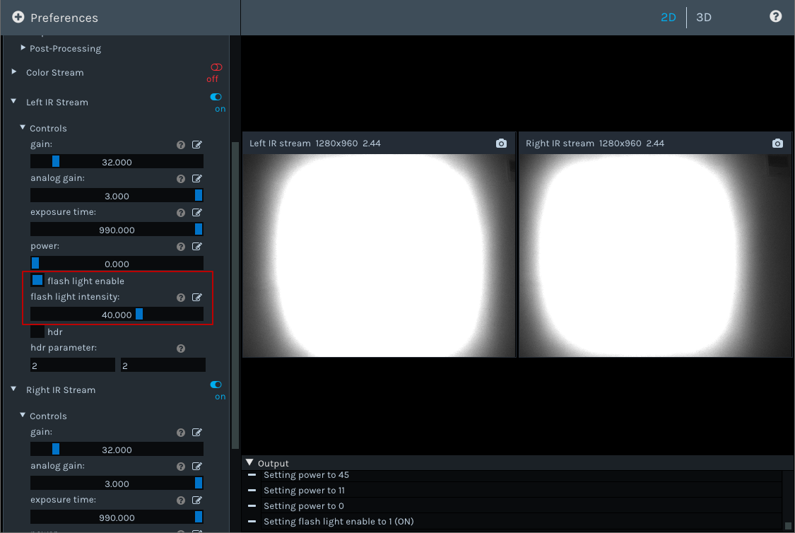
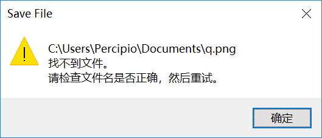

Percipio Viewer User Guide
============================    

Percipio Viewer is an image viewing software developed by Percipio.XYZ based on the Percipio Camport SDK. It can provide real-time preview of the camera's output, including depth map, color image, infrared image, and point cloud map.

Percipio Viewer is available in both Windows and Linux versions, and it is recommended to use the Windows version. The following sections will use the Percipio Viewer (Windows version) as an example to introduce its interface and functions.

.. figure:: image/percipioviewer_interface.png
   :width: 700px
   :align: center
   :alt: The Interface of Percipio Viewer Software 
   :figclass: align-center

    The Interface of Percipio Viewer Software

1. Preferences button: Clicking on the Preferences button will bring up a drop-down menu.
   
   .. figure:: image/preferences_menu.png
      :width: 480px
      :align: center
      :alt: The Drop-Down Menu
      :figclass: align-center

   a. Device list: You can select and open the camera from the list. Please refer to :ref:`Selecting the Camera <viewer:选择相机>` for details.
   b. Load local recording.
   c. Set the IP of the camera. Please refer to :ref:`Setting the Camera IP <viewer:设置相机 IP>` for details.
   d. Refresh the device list.
   e. Go to the Percipio Viewer User Guide page.

2. View Switching Area: Used to switch between 2D, 3D, Registration, and Color 3D views.
3. Control Panel Area: Used to view information, set work mode, turn on/off data stream, set component parameters, and record videos.   
   
   * |on| indicates that the data stream is turned on.
   * |off| indicates that the data stream is turned off.

4. Image Display Area: Used to display the depth map, color map, infrared map, and point cloud map.
5. Log Display Area: Used to display log information.

.. |off| image:: image/icon_stream_off.png
 

Quick Start
---------------

This section mainly introduces the usage process of Percipio Viewer：

1. :ref:`Setting the Camera IP Address <viewer:Setting the Camera IP Address>`
2. :ref:`Selecting the Camera <viewer:Selecting the Camera>`
3. :ref:`Viewing Information <viewer:Viewing Information>`
4. :ref:`Setting Operating Mode <viewer:etting Operating Mode>`
5. :ref:`Previewing Images <viewer:Previewing Images>`
6. :ref:`Saving Images <viewer:Saving Images>`
7. :ref:`Recording Videos <viewer:Recording Videos>`

Please complete the following steps before using Percipio Viewer：

1. Download the .zip file from `Download Section on PERCIPIO.XYZ Technology official website <https://www.percipio.xyz/downloadcenter/>`_  and unzip it to obtain the ``percipio-viewer-X.X.X.exe`` file.

2. Connect the Percipio camera to the host computer. For connection instructions on this please refer to :ref:`Hardware Connection <hardware-connection-label> .

Setting the Camera IP Address
~~~~~~~~~~~~~~~~~~

Percipio Viewer supports modifying the IP address of the camera to be either static or dynamic. Before setting the camera IP, please make sure the host computer's IP address is on the target network segment.   

Please follow these steps to set the camera's IP address：

1. Click on :guilabel:`Preferences` and select :guilabel:`Device IP Settings` from the drop-down menu to access **Device IP Settings** page.

   .. figure:: image/device_ip_settings_interface.png
      :width: 320px
      :align: center
      :alt: device IP settings
      :figclass: align-center        

2. In **Net interface list** column, select the network interface of the target network segment or choose **All network interfaces**.
3. Select the target camera's serial number in **Found device** column.
4. Fill in the camera's MAC address **Device mac address**、 the target IP address **Device target IP** 、the gateway **Device target gate** and the subnet mask **Device target mask**.
   
   .. note::
       
       If the Device target IP field is left blank, the camera's IP address will be set to a dynamic one. If filled in, it will be set to a static IP address.

5. Click on :guilabel:`Accept`.

The message "Device IP setting is successful" in the log area indicates that the IP has been successfully set.

The message "Device IP setting failed" in the log area indicates that the IP setting has failed. Please check your computer's network configuration, hardware connections, and ensure that the parameters on the Device IP Settings page are filled in correctly.

Selecting the Camera
~~~~~~~~~~~~~~~~~~

Starting from version 1.2.3 of Percipio Viewer, you need to manually select and open the camera after opening the program.

Please follow the steps below to select the camera (taking the camera with SN 207000106916 as an example)：

1. Dubble click the executable file ``percipio-viewer-X.X.X.exe`` to open Percipio Viewer software.
   
2. After the camera initialization is complete, click on :guilabel:`Preferences`, and then select :guilabel:`Refresh Source` in the drop-down menu to refresh the device list.

3. Choose the SN of the target camera **207000106916** from the device list.

   .. figure:: image/select_camera.png
      :width: 700px
      :align: center
      :alt: Selecting the Camera
      :figclass: align-center
   

.. note:: 

   If an error code is displayed after the serial number in the equipment list (such as "-1014" in the above image), it indicates that the camera cannot be opened properly.

Viewing Information
~~~~~~~~~

Click on |info| allows you to view camera information, including interface name, serial number, model, MAC/IP address、firmware version and configuration version.

   Camera Information

   USB 相机信息

.. |info| image:: image/icon_info.png

The firmware version information is quite lengthy, so you will need to hover your mouse over **Firmware Version** to view the complete content.

Setting Operating Mode
~~~~~~~~~~~~

Percipio Viewer supports setting the operating mode of the camera, and the camera captures images according to the settings.

When all data streams are set to |off| , click on |more|, and select the operating mode according to the table below.

.. list-table::
   :header-rows: 1

   * - Operating Mode
     - Camera Operating Status
   * - Trigger Mode Off 
     - After the data stream is turned on, the camera captures images continuously at the highest frame rate.
   * - Hardware Trigger Mode
     - An external hardware trigger signal source need to be connected to the camera. Then after turning on the data stream, the camera captures images according to the frequency of the trigger signal .
   * - Software Trigger Mode (continue)
     - After the data stream is turned on, the camera captures images upon receiving a software trigger signal.
   * - Software Trigger Mode (single)
     - With data streams turned on, clicking on "trigger" will cause the camera to capture one frame of image each time the button is clicked.

.. |more| image:: image/icon_more.png
.. |trigger| image:: image/icon_trigger.png

The selected operating mode will have an icon  **√**  displayed on its right side.

   The Selected Operating Mode

Previewing Images
~~~~~~~~~

Percipio Viewer supports previewing depth maps, color images, left/right infrared images, point cloud maps, and debugging component parameters.

Please follow these steps to preview images:

1. Start streaming to preview the corresponding image in real-time in the image display area.

   The title bar above the image displays the current data stream name, image resolution, and frame rate.

   .. figure:: image/show_stream_info.png
      :width: 700px
      :align: center
      :alt: Depth map, Color Image, Left/Right Infrared Image
      :figclass: align-center
      
      Depth map, Color Image, Left/Right Infrared Image
     
   .. |right| image:: image/icon_right.png  

2. Expand the page on the left side of the data stream by clicking on |right| , and adjust parameters according to actual needs.

  .. note::

 	  1. Some parameters need to be modified when the data stream is |off| . It is recommended to refer to the tips in the log information display area for instructions.
 	  2. Different camera models support different parameters, and the display on the Percipio Viewer interface changes accordingly. The following table describes the parameters of the camera with serial number **207000106916** as an example.
    
  .. figure:: image/para_207000106916.png
     :width: 700px
     :align: center
     :alt: Parameter Interface for Camera 207000106916
     :figclass: align-center
     
     Parameter Interface for Camera 207000106916

  .. dropdown:: Parameter Description
      :open:
      :animate: fade-in-slide-down
          
      **Depth Stream** 

      +----------------------+-----------------+-----------------------------------------------------------------------------------+
      | Category                 |    Parameter         |    Description                                                                           |
      +======================+=================+===================================================================================+
      | —                    |  Resolution     |  Resolution of depth map                                                                 |        
      +----------------------+-----------------+-----------------------------------------------------------------------------------+
      | Control              | Power           | Laser Intensity                                                                        |
      +----------------------+-----------------+-----------------------------------------------------------------------------------+
      | Depth Visualization  | Color Scheme    | Rendering method of the depth map                                                                |
      +----------------------+-----------------+-----------------------------------------------------------------------------------+
      | Post-Processing      | Fill Hole       | Rendering method of the depth map. For details, refer to :ref:`Fill Hole <viewer:Fill Hole>`。           |
      +                      +-----------------+-----------------------------------------------------------------------------------+
      |                      | Remove Outlier  | Noise reduction. For details, refer to :ref:`Remove Outlier <viewer:Remove Outlier>`。 |
      +----------------------+-----------------+-----------------------------------------------------------------------------------+

          
      **Color Stream** 

      +----------------------+--------------------+----------------------------------------------------------------------------------+
      | Category                 |    Parameter             |    Description                                                                         |
      +======================+====================+==================================================================================+
      | —                    |  Resolution        |  Resolution of color image                                                                |        
      +----------------------+--------------------+----------------------------------------------------------------------------------+
      |                      | analog gain        | Analog gain                                                                       |
      +                      +--------------------+----------------------------------------------------------------------------------+
      |                      | r/g/b gain         | R/G/B gain                                                                     |
      +                      +--------------------+----------------------------------------------------------------------------------+
      | Control              | exposure time      | Exposure time                                                                       |
      +                      +--------------------+----------------------------------------------------------------------------------+
      |                      | auto exposure      | Auto exposure，supported by some camera models only.                                                         |
      +                      +--------------------+----------------------------------------------------------------------------------+
      |                      | auto gain ctrl     | Auto gain control，supported by some camera models only.                                                        |
      +                      +--------------------+----------------------------------------------------------------------------------+
      |                      | auto white balance | Auto while balance，supported by some camera models only.                                                   |
      +----------------------+--------------------+----------------------------------------------------------------------------------+
      | Post-Processing      | Auto ISP           | Software ISP, Supported by some camera models only. For more information, please refer to :ref:`Auto ISP<viewer:Auto ISP>`. |
      +                      +--------------------+----------------------------------------------------------------------------------+
      |                      | Undistort EN       | Distortion enabling function. For more details, please refer to :ref:`Undistort<viewer:Undistort>`。|
      +----------------------+--------------------+----------------------------------------------------------------------------------+

      **Left IR / Right IR Stream** 

      +----------------------+-----------------+---------------------------------------+
      | Category                |    Parameter         |    Description                              |
      +======================+=================+=======================================+
      |  Control             | Gain            | Gain.                                |
      +                      +-----------------+---------------------------------------+
      |                      | Power           | Laser intensity.                            |
      +----------------------+-----------------+---------------------------------------+
 
  
3. You can click the  :guilabel:`2D`、 :guilabel:`3D`、 :guilabel:`Registration` and  :guilabel:`Color 3D` buttons in the View Switching Area to switch views.
   
   .. note::
    
      Registration or Color 3D views can only be switched to when both the Depth Stream and Color Stream are opened.

4. Place your mouse on the 2D/3D image and adjust the view using the following methods:
   
   * Zoom in/out: Scroll the mouse wheel.
   * Pan (only supported in 3D/Color 3D views): Press and drag the mouse wheel.
   * Rotate (only supported in 3D/Color 3D views): Press and drag the left mouse button.
   * Reset the view (only supported in 3D/Color 3D views): Click |reset|

    .. |reset| image:: image/reset.png

Saving Images
~~~~~~~~~

Follow the steps below to save 2D/3D images:

.. note:: 
    
    By default, the image files are saved in the C drive, but you can also change the storage path according to your preferences. If you are unable to save to the default path, please refer to :ref:`I can't save files to the C drive, what should I do? <viewer:I can't save files to the C drive, what should I do?>`

* Switch to the 2D view, click on |2D| ，select the save path, and click Save.

   .. |2D| image:: image/icon_save_2D.png
   .. |3D| image:: image/icon_save_3D.png

* Switch to the 3D/Color 3D view, click on |3D| , select the file format for the 3D point cloud image export(supports ``.xyz`` and ``.ply`` formats), select the save path, and click Save.

Recording Videos
~~~~~~~~~~~~~~~~~

Percipio Viewer supports recording videos while capturing images with a camera. During the video recording process, some parameters can be adjusted, but turning on/off the data stream is not supported.

Please follow these steps to record a video:

1. Click on |record|, set the save path for the ``.bag`` file and the video recording will start.

   .. |record| image:: image/icon_record.png

   .. note:: 

     The ``.bag`` file is saved in the C drive by default. If you cannot save it to the default path, refer to :ref:`I can't save files to the C drive, what should I do? <viewer:I can't save files to the C drive, what should I do?>`

   .. figure:: image/record_interface.png
      :align: center
      :alt: Video Recording
      :figclass: align-center

      Video Recording

2. Click on |stop| to end the video recording.               

   .. |stop| image:: image/icon_stop.png

   The save path for the ``.bag`` file will be displayed in the image display area's upper right corner and the Log Information display area.

To play back the recorded video, click on :guilabel:`Preferences`, then click on :guilabel:`Load Recorded Sequence` in the drop-down menu and select the target ``.bag`` file.

.. figure:: image/load_recorded_sequence.png
   :width: 320px
   :align: center
   :alt: Video Playback
   :figclass: align-center
   
   Video Playback

Image Debugging (Software)
----------------

This section mainly introduces the image debugging functions supported by Percipio Viewer software:

* :ref:`Image Alignment <viewer:Image Alignment>`
* :ref:`Fill Hole <viewer:Fill Hole>`
* :ref:`Remove Outlier <viewer:Remove Outlier>`
* :ref:`Auto ISP  <viewer:Auto ISP>`
* :ref:`Undistort  <viewer:Undistort>`

Image Alignment
~~~~~~~~~~~

Percipio Viewer supports RGB-Depth alignment and RGB-3D alignment.

When the Depth Stream and Color Stream are in status |on|, click the following buttons to switch to the corresponding alignment view.

- Click on :guilabel:`Registration` to switch to the color-depth alignment view.
- Click on :guilabel:`Color 3D` to switch to the color-point cloud alignment view.

   
   Color-Depth Alignment

.. figure:: image/rgb3D.png
   :width: 700px
   :align: center
   :alt: Color-Point Cloud Alignment
   :figclass: align-center
   
   Color-Point Cloud Alignment

Fill Hole 
~~~~~~~~~~~~~~~~~~~~~~

The "Fill Hole" function can fill in missing data on a depth map. When used in combination with the "Remove Outlier" noise reduction function, it can achieve the best depth map imaging results.

When the Depth Stream is in status |on| , select :guilabel:`Fill Hole` and adjust the parameters **k Size** and **h Size**.

.. note:: 

    If the parameter values of k Size and h Size are set too large, there may be distortion on the depth map.

Comparison before and after using the Fill Hole function:

.. figure:: image/fill_hole_before.png 
   :width: 700px
   :align: center
   :alt: Before Using the Fill Hole Function
   :figclass: align-center
   
    Before Using the Fill Hole Function
       

   
   After Using the Fill Hole Function

Remove Outlier
~~~~~~~~~~~~~~~~~~~~~~~~~

This function can reduce outliers on the depth map and optimize the imaging effect of the depth map.

When Depth Stream is in status |on|, select :guilabel:`Remove Outlier` and adjust the **spk size** parameter。

Auto ISP
~~~~~~~~~~~~~~

This function is used for post-processing of color images. After the software-level ISP processing, the RAW BAYER image with color deviation can be processed into a color image in a normal color space.

.. note:: 

   Cameras with hardware ISP modules can output color images in a normal color space, and therefore does not need to be post-processed by the Auto ISP function.

When Color Stream is in status |off|, select :guilabel:`Auto ISP` and then turn on the data stream.

.. figure:: image/auto_isp_settings.png 
   :width: 320px
   :align: center
   :alt: Auto ISP  
   :figclass: align-center

Undistort
~~~~~~~~~~~~~~~~~~~~

This function is used for post-processing of color images and can correct the distortion of the output color image.

when Depth Stream is in status |on|, select :guilabel:`Undistort EN` to  obtain the distortion-corrected color image.

.. figure:: image/undistort_settings.png 
   :width: 320px
   :align: center
   :alt: Undistort 
   :figclass: align-center

Image Debugging（Camera）
----------------

This section mainly introduces how to set camera-specific image debugging functions through Percipio Viewer.

The ToF series
~~~~~~~~~~

The following are the image debugging functions unique to the ToF series. They can only be set in the interface if the camera is opened with Percipio Viewer.

* :ref:`Depth Quality <viewer:Depth Quality>`
* :ref:`ToF Channel <viewer:ToF Channel>`
* :ref:`ToF Modulation Threshold <viewer:ToF Modulation Threshold>`
* :ref:`ToF Jitter Threshold <viewer:ToF Jitter Threshold>`
* :ref:`Filter Threshold <viewer:Filter Threshold>`
* :ref:`HDR Ratio <viewer:HDR Ratio>`

Depth Quality 
+++++++++++++++++++++++

This function is used to set the quality of the depth map output by the camera to adapt to the needs of different applications.

When Depth Stream is in status |off|, set **depth quality** according to actual needs, and then turn on the data stream.

* basic: large depth value jitter, high output frame rate.
* medium: medium depth value jitter, medium output frame rate. 
* high: small depth value jitter, low output frame rate.

.. figure:: image/depth_quality_basic.png
   :width: 320px
   :align: center
   :alt: depth quality basic
   :figclass: align-center
   
   depth quality basic 

.. figure:: image/depth_quality_medium.png
   :width: 320px
   :align: center
   :alt: depth quality medium
   :figclass: align-center
   
   depth quality medium 

   
   depth quality high

ToF Channel
+++++++++++++++++++++++

This function is used to set the modulation channel of the ToF depth camera. Different modulation channels have different modulation frequencies and do not interfere with each other.

When Depth Stream is in status |off|, set **tof channel** to make sure that the modulation channels of the same series of ToF cameras in the same scene are different.

ToF Modulation Threshold 
++++++++++++++++++++++++++++++++++++++++

This function is used to set the threshold for the ToF depth camera to receive the laser modulation intensity. Pixels with modulation intensity below this threshold will not be used to calculate depth, and their depth value will be set to 0.

When Depth Stream is in status |on|, modify **tof modulation threshold** based on the real-time depth map.

ToF Jitter Threshold
+++++++++++++++++++++++++++++++

This function is used to set the jitter filtering threshold for the ToF depth camera. The larger the threshold value, the less depth data jitter on the depth map's edge is filtered.

When Depth Stream is in status |on|, modify **tof jitter threshold** based on the real-time depth map to filter out jittered pixels on the edge.

Filter Threshold
++++++++++++++++++++++++++++

This function is used to set the outlier filtering threshold for ToF depth camera. The smaller the threshold value, the more outliers are filtered.

When Depth Stream is in status |on|, adjust **filter threshold** in real time based on the depth map to filter outliers out.

HDR Ratio
+++++++++++++++++++++++

This function is used to optimize the depth image effect in high-contrast scenes. Currently, only TL460-S1-E1 in the ToF series support this function.

Please follow the steps blow to set up the HDR Ratio: 

1. When all data streams are in status |off|, click on |more| and select a trigger mode according to your needs.
   
    - Hardware Trigger Mode 
    - Software Trigger Mode (continue) 
    - Software Trigger Mode (single) 

2. When Depth Stream is in status |off|, set **depth quality** to **high**。
3. When Depth Stream is in status |on|, adjust **HDR ratio** in real time based on the depth map.

The PS series
~~~~~~~~~~~~~~~~~

The following are the image debugging functions unique to the PS801 series. They can only be set in the interface if the camera is opened with Percipio Viewer.

* :ref:`Flash Light <viewer:Flash Light>`
* :ref:`HDR <viewer:HDR>`

Flash Light
+++++++++++++++++

This function is used to assist the online dynamic calibration for the camera.

When both Left IR Stream and Right IR Stream are in status |on|, select :guilabel:`flash light enable`and adjust the **flash light intensity** according to actual needs.

   

   
   Set Flash Light Function

HDR
+++++++++++++++

This function is used to optimize the depth imaging effect in high-contrast scenes. After setting the HDR parameters, it is necessary to adjust the exposure time of the Left/Right IR to obtain the best depth map imaging effect.

PLease follow the steps below to set up the HDR function:

1. When both Left IR Stream and Right IR Stream are in status |on|, select :guilabel:`HDR` to set **Parameter 1** 和 **Parameter 2**, and then press :guilabel:`Enter` to confirm the settings.
   
   .. tip:: 

      The setting range for parameter 1 and parameter 2 is 0，1，2.

   .. figure:: image/parameter_1_2.png
      :width: 320px
      :align: center
      :alt: Set Parameter 1 and Parameter 2
      :figclass: align-center
   
      Set Parameter 1 and Parameter 2

2. Adjust the **exposure time** of Left IR and Right IR to obtain the best depth map.

Comparasons before and after Implementing the HDR function:

.. figure:: image/disable_hdr.png
   :width: 700px
   :align: center
   :alt: Before Implementing the HDR Function
   :figclass: align-center
   
   Before Implementing the HDR Function

.. figure:: image/enable_hdr.png
   :width: 700px
   :align: center
   :alt: After Implementing the HDR Function
   :figclass: align-center
   
   After Implementing the HDR Function

.. _viewer-faq-label:

FAQs
---------------

What operating systems does Percipio Viewer support?
~~~~~~~~~~~~~~~~~~~~~~~~~~~~~~~~~~~~~~~~

Percipio Viewer supports the following operating systems:
*  Windows：10/11
*  Linux：Ubuntu 16.04/18.04/20.04

I can't save files to the C drive, what should I do?
~~~~~~~~~~~~~~~~~~~~~~~~~~~~~~~~~~~

**Problem Description**

An error message appears when trying to save 2D images, 3D images and recorded videos to the C drive.

   
   Error Message

**Analysis** 

The computer may have "ransomware protection" enabled, which limits some applications from making unauthorized changes to files, filefolders and memory areas on the computer.

**Solution** 

Search for " **ransonmware protection** " on the computer and disable **access to controlled folders**.

   
   Disable Access to Controlled Folders

